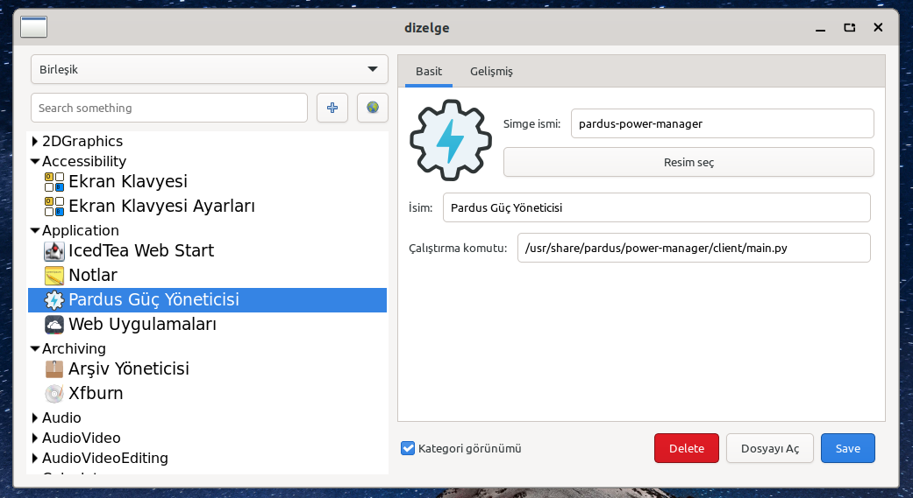

# Dizelge
A .desktop file editor built on gtk4 in c++.



# Building from source
Required dependencies: ```g++ blueprint-compiler libgtk-4-dev libgtkmm-4.0-dev gettext```

```bash
$ make
$ sudo make install
```
